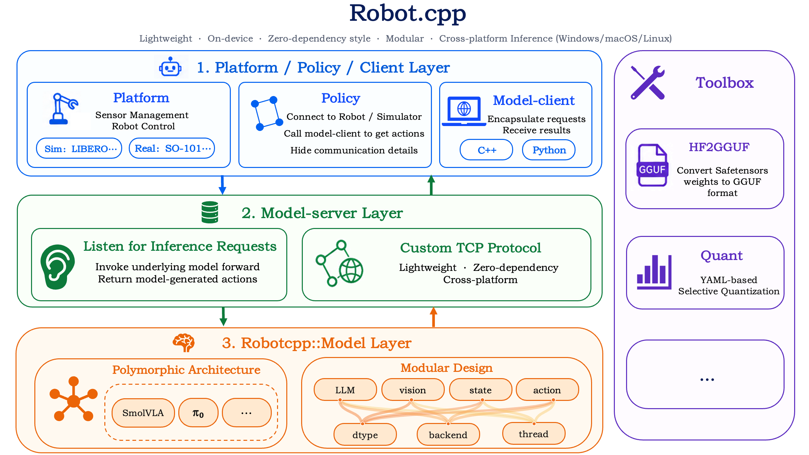

<p align="center">
  <strong>Demo video placeholder</strong>
  <br>
  <sub>Replace this block with an animated GIF/WebP demo for GitHub autoplay.</sub>
</p>

<h1 align="center">🤖 Robot.cpp</h1>

<h3 align="center">Run your robot model on any device, easily.</h3>

<p align="center">
  <strong>English</strong> | <a href="README_zh.md">简体中文</a>
</p>

<p align="center">
  <a href="https://huggingface.co/rrobottt"></a>
  <a href="assets/readme/wechat-group.jpg"></a>
</p>

<p align="center">
  <a href="https://github.com/Robot-cpp/robot.cpp/releases/latest"></a>
  <a href="https://github.com/Robot-cpp/robot.cpp/releases/latest"></a>
  <a href="https://github.com/Robot-cpp/robot.cpp/releases/latest"></a>
</p>

<p align="center">
  
</p>

Robot.cpp is a lightweight on-device robot model inference framework built on top of llama.cpp. It inherits llama.cpp's zero-dependency and lightweight philosophy: robot model inference can run without complex Python dependency setup or PyTorch environment configuration. This makes Robot.cpp especially useful for cross-platform deployment and edge devices where environment setup is often painful.

The core concept in Robot.cpp is [`model-server`](robot_server/README.md), which provides the main unified model interface. In practice, you start `model-server`; it listens for robot inference requests, receives observations from the robot, runs the underlying model forward pass, and returns the generated action. To keep the system lightweight and dependency-free, the communication layer uses a custom TCP protocol.

For robot-side usage, this repository provides examples for both simulation and real hardware: LIBERO as a simulation template, and the low-cost SO-101 as a real-robot template. The project is organized around the following concepts:

* `model-client`: a client for communicating with `model-server`. It wraps the communication protocol and sends requests to `model-server`. We provide both C++ and Python clients.
* `policy`: an abstraction layer that uses `model-client` and connects it to a specific robot or simulation system. A policy receives observations from the robot platform, processes them, sends them through `model-client`, and returns the final action output. This layer hides the communication details and is easier to use.
* `platform`: a concrete robot platform responsible for sensor management and robot control.
* `robotcpp::Model`: the actual model runtime implementation. Different models are abstracted through polymorphism, so the upper layers see one unified interface. At the same time, Robot.cpp follows a modular design philosophy: each model is split into multiple GGUF modules, making it possible to use different precision, backend, thread, and other configurations for different model components.

We also provide two tools to support robot model development:

* [`hf2gguf`](tools/hf2gguf/README.md): converts safetensors checkpoints into the GGUF files used by this project.
* [`quant`](tools/quant/README.md): selectively quantizes arbitrary tensor groups in a model. Users only need to adjust a YAML plan to generate quantized GGUF files.

---

## 🚀 Quick Start

```bash
git clone https://github.com/Robot-cpp/robot.cpp
cd robot.cpp
git submodule update --init --recursive
```

This section introduces three usage paths to help you quickly understand the repository:

* Starting `model-server` and connecting it to a minimal dummy `model-client`.
* Using `model-server` in a simulation platform, using LIBERO as the example.
* Using `model-server` on a real robot, using SO-101 as the example.

### 🔌 Start model-server and connect a dummy client

We use SmolVLA GGUF files as the example for starting `model-server`.

#### Step 0: Download a GGUF model

Download a sample GGUF model from Hugging Face: [huggingface.co/rrobottt/smolvla-so101-fp32](https://huggingface.co/rrobottt/smolvla-so101-fp32)

#### Step 1: Start model-server

There are two ways to start `model-server`.

##### Option 1: Download a prebuilt binary

For several platforms and configurations, we provide prebuilt `model-server` binaries on the release page.

After downloading, run `model-server` like this:

```bash
./model-server \
  --model-type smolvla \
  --llm /path/to/smolvla-llm-f32.gguf \
  --mmproj /path/to/mmproj-smolvla-f32.gguf \
  --state-proj /path/to/state-proj-smolvla-f32.gguf \
  --action-expert /path/to/action-expert-smolvla-f32.gguf \
  --host 127.0.0.1 \
  --port 5555
```

##### Option 2: Build locally

For general local setups, we provide ready-to-use build-and-launch shells for three platforms. You can modify the environment variables inside the scripts, or override them directly with `export`. See [robot_server/README.md](robot_server/README.md) for details.

| Backend | macOS                                                   | Linux                                                    | Windows                                                     |
| ------- | ------------------------------------------------------- | -------------------------------------------------------- | ----------------------------------------------------------- |
| CUDA    | -                                                       | `robot_server/shell/launch_robot_server_linux_cuda.sh` | `robot_server/shell/launch_robot_server_windows_cuda.bat` |
| CPU     | `robot_server/shell/launch_robot_server_mac_cpu.sh`   | `robot_server/shell/launch_robot_server_linux_cpu.sh`  | `robot_server/shell/launch_robot_server_windows_cpu.bat`  |
| Metal   | `robot_server/shell/launch_robot_server_mac_metal.sh` | -                                                        | -                                                           |

When startup succeeds, you should see:

```text
[model-server] listening on 127.0.0.1:5555 model=smolvla
```

#### Step 2: Send one dummy request to model-server

After the server starts, it listens for requests. We provide a minimal example that sends a random observation request. You can use either Python or C++.

##### Minimal Python example

```bash
pip install numpy
python robot_client/examples/python/minimal_example.py
```

##### Minimal C++ example

We provide a build-to-run example in `robot_client/shell/cpp_client_example.sh`. Adjust these environment variables as needed:

| Environment variable | Default                                  | Purpose                                                                                        |
| -------------------- | ---------------------------------------- | ---------------------------------------------------------------------------------------------- |
| `ROBOT_CPP_ROOT`   | unset; required                          | Repository root.                                                                               |
| `BUILD_DIR`        | `${ROBOT_CPP_ROOT}/build_robot_client` | C++ client CMake build directory.                                                              |
| `PORT`             | `5555`                                 | Server port used by the client.                                                                |
| `BUILD_CLIENT`     | `0`                                    | Whether to force rebuild the client. Set to`1` to rebuild even if the binary already exists. |
| `CMAKE_BIN`        | `cmake`                                | CMake command path, useful for selecting a custom CMake binary.                                |

Then run:

```bash
bash robot_client/shell/cpp_client_example.sh
```

### 🧪 Using model-server in simulation, using LIBERO as the example

See the [LIBERO simulation evaluation guide](eval/libero/README.md).

### 🦾 Using model-server on real hardware, using SO-101 as the example

See the [SO-101 deployment guide](eval/lerobot_so101/README.md). A video tutorial is also planned (bilibili link).

---

## ⚡ Performance

We benchmark Robot.cpp on several platforms. Each measurement uses 5 warmup runs and 100 loop runs. The reported latency is the average time from receiving the image, through preprocessing and forward inference, to producing a usable action chunk, measured in milliseconds. All state projectors remain in f32 precision.

For the LIBERO setting, the input contains two 256x256 images and an 8-dimensional state. For the SO-101 real-robot setting, the input contains one 224x224 image and a 6-dimensional state.

For SmolVLA preprocessing, we follow the official default setting: images are first resized to 512x512.

| Model                  | Mac M4 Pro (CPU) | Mac M4 Pro (Metal) | RTX 4090 | RTX 3060 | A100 | Jetson AGX Orin |
| ---------------------- | ---------------: | -----------------: | -------: | -------: | ---: | --------------- |
| smolvla@libero (bf16*) |              527 |                216 |       28 |          |   43 |                 |
| smolvla@libero (f32)   |              577 |                236 |       32 |          |   41 |                 |
| smolvla@so-101 (bf16*) |              339 |                145 |       23 |          |   35 |                 |
| smolvla@so-101 (f32)   |              396 |                158 |       24 |          |   33 |                 |
| pi0@libero (f32)       |             1839 |                710 |       83 |          |   79 |                 |
| pi0@libero (bf16*)     |             1954 |                635 |       57 |          |   70 |                 |

> `bf16*`: on Mac, f16 results are used in place of bf16 because current Mac bf16 support is not ideal.

---

## 🧩 Model Zoo

This section lists converted GGUF models that can be used directly with `model-server` for smoke tests and quick starts. For your own real-world scenarios, we recommend using [`hf2gguf`](tools/hf2gguf/README.md) to generate your own GGUF models. Different components can also use different precisions; in practice, the best precision choice is often component-specific. In our examples, the state projector always stays in f32, while the other GGUF files follow the listed precision. You can mix and match them to explore better accuracy/performance tradeoffs.

| Model   | Benchmark | Precision | Link                                                                    |
| ------- | --------- | --------- | ----------------------------------------------------------------------- |
| SmolVLA | SO-101    | bf16      | [smolvla-so101-bf16](https://huggingface.co/rrobottt/smolvla-so101-bf16) |
| SmolVLA | SO-101    | f16       | [smolvla-so101-fp16](https://huggingface.co/rrobottt/smolvla-so101-fp16) |
| SmolVLA | SO-101    | f32       | [smolvla-so101-fp32](https://huggingface.co/rrobottt/smolvla-so101-fp32) |
| pi0     | LIBERO    | bf16      | [pi-libero-bf16](https://huggingface.co/rrobottt/pi-libero-bf16)         |
| pi0     | LIBERO    | f16       | [pi0-libero-f16](https://huggingface.co/rrobottt/pi0-libero-f16)         |
| pi0     | LIBERO    | f32       | [pi0-libero-f32](https://huggingface.co/rrobottt/pi0-libero-f32)         |

---

## 🗂️ Repository Layout

Key directories:

```text
robot.cpp/
├── src/
│   ├── model-cli.cpp              # Debug/smoke entrypoint for invoking the Model layer from the command line
│   └── models/
│       ├── model.h                # Unified Model abstraction: predict / reset / type
│       ├── model_factory.cpp      # Creates concrete models from --model-type
│       ├── ggml_backend.*         # Shared ggml backend / buffer / scheduler abstractions
│       ├── gguf_loader.*          # Shared GGUF loading abstraction
│       ├── smolvla/               # SmolVLA runtime implementation
│       └── pi0/                   # pi0 runtime implementation
├── robot_server/
│   ├── model-server.cpp           # Persistent daemon entrypoint; listens for local TCP requests
│   ├── protocol.*                 # Little-endian binary protocol
│   ├── session.* / socket.*       # Connections, packet I/O, and cross-platform socket wrappers
│   ├── model_adapter.*            # Glue between protocol observations and the Model layer
│   ├── shell/                     # macOS / Linux / Windows model-server launch scripts
│   └── test/                      # Tests and helper scripts
├── robot_client/
│   ├── cpp/                       # C++ model-client
│   ├── python/                    # Python model-client
│   ├── policy/                    # Policy wrappers for robot platforms / simulations
│   ├── examples/                  # Minimal client examples
│   └── shell/                     # Client build and run scripts
├── tools/
│   ├── hf2gguf/                   # Hugging Face checkpoint -> GGUF conversion tools
│   └── quant/                     # YAML-plan-based selective GGUF tensor quantization tool
├── eval/
│   ├── base_platform.py           # Shared base class for real-robot platforms
│   ├── libero/                    # LIBERO simulation evaluation
│   └── lerobot_so101/             # SO-101 real-robot scripts and examples
└── third_party/
    ├── llama.cpp/                 # ggml / llama.cpp backend
    └── lerobot/                   # LeRobot dependency or reference code
```

---

## 🌱 Extension and Contribution

Robot.cpp welcomes community contributions for new model runtimes, platform adapters, evaluation flows, model conversion tools, and performance optimization. We aim to keep the core inference framework lightweight, cross-platform, and easy to reproduce, while allowing different robot models and platforms to connect through a unified interface.

If you want to extend this project, start with these documents:

* [How to add a new model](src/readme.md)
* How to add a new platform: [real robot](eval/README.md), [simulation](eval/HOW_TO_ADD_NEW_SIM.md).

Issues and PRs are welcome. For larger model-architecture changes, protocol changes, or platform abstraction changes, we recommend opening an issue first to align on the interface boundary.

---

## 📄 License

Robot.cpp source code is released under the Apache License, Version 2.0. See [LICENSE](LICENSE) for the full license text.

This repository also includes third-party open-source components, each under its own license. See the license files under `third_party/` for details.

---

## 🙏 Acknowledgements

Robot.cpp's design and implementation benefit from several excellent open-source projects:

* [llama.cpp](https://github.com/ggerganov/llama.cpp): provides lightweight local inference, the GGML/GGUF ecosystem, and cross-platform backend foundations. This project continues building robot model inference capabilities on top of its engineering philosophy and low-level runtime.
* [LeRobot](https://github.com/huggingface/lerobot): provides reference implementations for robot data, policy training, and real-robot integration. The SO-101 real-robot example and parts of the evaluation flow in this project are inspired by the LeRobot ecosystem.
* [LIBERO](https://github.com/Lifelong-Robot-Learning/LIBERO): provides robot simulation tasks and evaluation benchmarks. The LIBERO simulation evaluation flow in this project is based on its task environments and benchmark design.
* [OpenPI](https://github.com/Physical-Intelligence/openpi): provides the pi0 policy model and related open-source implementation. The pi0 runtime, conversion, and evaluation work in this project references OpenPI's model design.

Thanks to these projects and communities for their contributions to robot learning and on-device inference.
