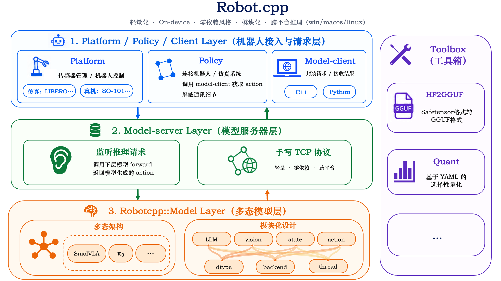

<p align="center">
  <strong>演示视频占位</strong>
  <br>
  <sub>后续可替换为 GIF/WebP 动图，以便在 GitHub README 顶部自动播放。</sub>
</p>

<h1 align="center">🤖 Robot.cpp</h1>

<h3 align="center">轻松让机器人模型运行在任意设备上。</h3>

<p align="center">
  <a href="README.md">English</a> | <strong>简体中文</strong>
</p>

<p align="center">
  <a href="https://huggingface.co/rrobottt"></a>
  
</p>

<p align="center">
  <a href="https://github.com/Robot-cpp/robot.cpp/releases/latest"></a>
  <a href="https://github.com/Robot-cpp/robot.cpp/releases/latest"></a>
  <a href="https://github.com/Robot-cpp/robot.cpp/releases/latest"></a>
</p>

<p align="center">
  
</p>

Robot.cpp是一个轻量化的on-device机器人模型推理框架，在llama.cpp的基础上进行开发，继承了其零依赖、轻量化的哲学，无需python相关的依赖配置，即可完成机器人模型推理，这使得其在跨平台尤其是环境配置复杂的边缘设备上具有优势。

具体而言，robot.cpp最核心的概念是 [`model-server`](robot_server/README_zh.md)，其为最主要的统一模型接口。在实际工作，仅需要启动 `model-server`，其会监听机器人发送的推理请求，即接受机器人传来的observation，在下层model进行forward计算，返回model生成的action。整体通信设计上为了轻量化零依赖采用手写TCP协议的方式。

对于如何在机器人上使用，我们亦都提供了一些示例，分别提供了libero和低成本的SO-101的示例作为仿真与真机的使用模板。具体而言，我们采用以下概念组织：

* `model-client`：用来与 `model-server`进行通信的client，封装通信协议部分，负责给 `model-server`发送请求。我们提供了c++和python版本的client，供君选择。
* `policy`：实际使用 `model-client`，与具体的机器人系统或者仿真系统连接的一层抽象，policy负责接受机器人平台给的observation，对其进行处理，然后交给 `model-client`，获得action的最终输出，在这一层看不到通信细节，使用更加友好。
* `platform`：不同的机器人平台，负责传感器管理，以及机器人控制。
* `robotcpp::model`：实际的model runtime实现。具体而言，我们采用多态来对不同模型进行抽象，使暴露到上层的接口统一。另一方面我们使用模块化设计的哲学，每个model都被拆成多个GGUF模块，以采用不同的精度，backend，线程等配置。

工具上，我们亦都提供了两种工具帮助更好地对机器人模型进行开发：

* [`hf2gguf`](tools/hf2gguf/README_zh.md)：用来将safetensor格式的checkpoint转化成项目所需的gguf格式。
* [`quant`](tools/quant/README_zh.md)：对模型的任意tensor族群进行选择性quant的工具，用户仅需要调整yaml进行需求配置即可完成量化gguf的生成。

---

## 🚀 快速使用

```bash
git clone https://github.com/Robot-cpp/robot.cpp
cd robot.cpp
git submodule update --init --recursive
```

我们介绍三类使用案例来帮助你快速了解本仓库：

* model-server的启动，其与最小dummy model-client通信的案例。
* model-server在仿真平台上的使用（以LIBERO为例）。
* model-server在真机平台上的使用（以SO-101为例）。

### 🔌 model-server的启动与连接dummy client

我们以smolvla的gguf为例，教您快速使用model-server。

#### Step 0：下载gguf model

在hugging-face上下载一份gguf示例：[huggingface.co/rrobottt/smolvla-so101-fp32](https://huggingface.co/rrobottt/smolvla-so101-fp32)

#### Step 1：model-server的启动

我们提供了两种方式来完成model-server的启动。

##### 方法1：直接下载

对于特定的一些平台与设定，我们已经预编译了一些`model-server`的二进制文件，可以直接在release page下载下来直接用。

下载之后，可以直接用下面的方式运行`model-server`：

```bash
./model-server \
  --model-type smolvla\
  --llm /path/to/smolvla-llm-f32.gguf \
  --mmproj /path/to/mmproj-smolvla-f32.gguf \
  --state-proj /path/to/state-proj-smolvla-f32.gguf \
  --action-expert /path/to/action-expert-smolvla-f32.gguf \
  --host 127.0.0.1 \
  --port 5555
```

##### 方法2：本地编译

对于更加一般的情况，我们也提供了三个平台的开箱即用编译+启动的shell，可以通过修改shell里的环境变量，或者直接export的形式来快速在本机实现启动。详情参见 [robot_server/README_zh.md](robot_server/README_zh.md)

| Backend | macOS                                                   | Linux                                                    | Windows                                                     |
| ------- | ------------------------------------------------------- | -------------------------------------------------------- | ----------------------------------------------------------- |
| CUDA    | -                                                       | `robot_server/shell/launch_robot_server_linux_cuda.sh` | `robot_server/shell/launch_robot_server_windows_cuda.bat` |
| CPU     | `robot_server/shell/launch_robot_server_mac_cpu.sh`   | `robot_server/shell/launch_robot_server_linux_cpu.sh`  | `robot_server/shell/launch_robot_server_windows_cpu.bat`  |
| Metal   | `robot_server/shell/launch_robot_server_mac_metal.sh` | -                                                        | -                                                           |

启动成功后会显示：

```text
[model-server] listening on 127.0.0.1:5555 model=smolvla
```

#### Step 2：完成一次对model-server的dummy请求

server启动过后，会监听请求，我们提供了一份最小示例来进行一个随机的observation请求。可以使用python或者c++的方式来进行请求。

##### Python最小例子

```bash
pip install numpy
python robot_client/examples/python/minimal_example.py
```

##### C++最小例子

我们提供了一个从编译到运行的例子（`robot_client/shell/cpp_client_example.sh`），按需修改以下环境变量：

| 环境变量           | 默认值                                   | 作用                                                                   |
| ------------------ | ---------------------------------------- | ---------------------------------------------------------------------- |
| `ROBOT_CPP_ROOT` | 无，必须设置                             | 仓库根目录。                                                           |
| `BUILD_DIR`      | `${ROBOT_CPP_ROOT}/build_robot_client` | C++ client 的 CMake build 目录                                         |
| `PORT`           | `5555`                                 | client 连接的 server port                                              |
| `BUILD_CLIENT`   | `0`                                    | 是否强制重新build client。设为`1` 时即使 binary 已存在也会重新 build |
| `CMAKE_BIN`      | `cmake`                                | 使用的 CMake 命令路径，可用于指定自定义 CMake                          |

然后运行下面的bash：

```bash
bash robot_client/shell/cpp_client_example.sh
```

### 🧪 model-server在仿真平台上的使用（以LIBERO为例）

详见 [LIBERO 仿真评测说明](eval/libero/README_zh.md)。

### 🦾 model-server在真机平台上的使用（以SO-101为例）

详见 [SO101部署说明](eval/lerobot_so101/README_zh.md)。亦可参考视频教程（bilibili link）

---

## ⚡ 性能

我们在不同的平台测试了我们的实现性能，我们对模型进行5次warmup，100次loop，取其从收到图片开始包括process，forward，到输出可用action chunk的latency平均值（单位：ms）。所有state projector均保持f32精度。

其中，对libero设定，输入为两张256x256的图片，输入的state维度为8；对so101的真机设定，输入为一张224x224的图片，输入的state维度为6。

其中对于smolvla的preprocess设定，参考官方的基本设定，即首先会将图片变成512*512。

| Model                  | Mac M4 Pro (CPU) | Mac M4 Pro (Metal) | RTX 4090 | RTX 3060 | A100 | Jetson AGX Orin |
| ---------------------- | ---------------: | -----------------: | -------: | -------: | ---: | --------------- |
| smolvla@libero (bf16*) |              527 |                216 |       28 |          |   43 |                 |
| smolvla@libero (f32)   |              577 |                236 |       32 |          |   41 |                 |
| smolvla@so-101 (bf16*) |              339 |                145 |       23 |          |   35 |                 |
| smolvla@so-101 (f32)   |              396 |                158 |       24 |          |   33 |                 |
| pi0@libero (f32)       |             1839 |                710 |       83 |          |   79 |                 |
| pi0@libero (bf16*)     |             1954 |                635 |       57 |          |   70 |                 |

> `bf16*`：在 Mac上使用 f16 结果替代 bf16，因为当前 Mac对 bf16 的支持不够好。

---

## 🧩 model-zoo

这里整理一些已经转换好的 GGUF 模型，可以直接配合 `model-server` 做smoke test，以方便quick start！但针对自己的实际场景，我们推荐使用[hf2gguf](tools/hf2gguf/README_zh.md)l来生成自己的GGUF model！并且对于不同的部分，您还可以自定义不同的精度，来实现不同部分的精度组合（事实上，不同部分的最优精度通常是不同的），我们的例子中，state proj始终保持f32精度，其他的gguf随着precision精度变化而变化，您可以自行组合，探索更好更高效的性能tradeoff！

| Model   | Benchmark | Precision | Link                                                                    |
| ------- | --------- | --------- | ----------------------------------------------------------------------- |
| SmolVLA | SO-101    | bf16      | [smolvla-so101-bf16](https://huggingface.co/rrobottt/smolvla-so101-bf16) |
| SmolVLA | SO-101    | f16       | [smolvla-so101-fp16](https://huggingface.co/rrobottt/smolvla-so101-fp16) |
| SmolVLA | SO-101    | f32       | [smolvla-so101-fp32](https://huggingface.co/rrobottt/smolvla-so101-fp32) |
| pi0     | LIBERO    | bf16      | [pi-libero-bf16](https://huggingface.co/rrobottt/pi-libero-bf16)         |
| pi0     | LIBERO    | f16       | [pi0-libero-f16](https://huggingface.co/rrobottt/pi0-libero-f16)         |
| pi0     | LIBERO    | f32       | [pi0-libero-f32](https://huggingface.co/rrobottt/pi0-libero-f32)         |

---

## 🗂️ 仓库架构

关键目录如下：

```text
robot.cpp/
├── src/
│   ├── model-cli.cpp              # 直接从命令行调用 Model 层的调试 / smoke 入口
│   └── models/
│       ├── model.h                # 统一 Model 抽象：predict / reset / type
│       ├── model_factory.cpp      # 根据 --model-type 创建具体模型
│       ├── ggml_backend.*         # ggml backend / buffer / scheduler 等公共抽象
│       ├── gguf_loader.*          # GGUF 读取的公共抽象
│       ├── smolvla/               # SmolVLA runtime实现
│       └── pi0/                   # pi0 runtime实现
├── robot_server/
│   ├── model-server.cpp           # 常驻 daemon 入口，监听本机 TCP 请求
│   ├── protocol.*                 # little-endian 二进制协议
│   ├── session.* / socket.*       # 连接、收发包和跨平台 socket 封装
│   ├── model_adapter.*            # 协议 observation 与 Model 层之间的胶水
│   ├── shell/                     # macOS / Linux / Windows 的model-server启动脚本
│   └── test/                      # 测试和辅助脚本
├── robot_client/
│   ├── cpp/                       # C++ model-client
│   ├── python/                    # Python model-client
│   ├── policy/                    # 面向机器人platform / 仿真的 policy 封装
│   ├── examples/                  # 最小 client 示例
│   └── shell/                     # client 编译与运行脚本
├── tools/
│   ├── hf2gguf/                   # Hugging Face checkpoint -> GGUF 转换工具
│   └── quant/                     # 基于 YAML plan 的 GGUF tensor 选择性量化工具
├── eval/
│   ├── base_platform.py           # 真机 platform 的统一基类
│   ├── libero/                    # LIBERO 仿真评测
│   └── lerobot_so101/             # SO-101 真机相关脚本与示例
└── third_party/
    ├── llama.cpp/                 # ggml / llama.cpp 后端
    └── lerobot/                   # LeRobot 相关依赖或参考代码
```

---

## 🌱 扩展与贡献

robot.cpp 欢迎社区贡献新的模型 runtime、平台适配、评测流程、模型转换工具与性能优化。我们希望保持核心推理框架轻量、跨平台、易于复现，同时让不同机器人模型和平台能够以统一接口接入。

如果你希望扩展本项目，可以先阅读以下文档：

* [如何新增一个新的模型](src/readme_zh.md)
* 如何接入一个新的平台：[真机](eval/readme_zh.md)、[仿真](eval/HOW_TO_ADD_NEW_SIM_zh.md)。

欢迎通过 issue 讨论设计，也欢迎提交 PR。对于较大的模型结构、协议变更或平台抽象调整，建议先开 issue 对齐接口边界。

---

## 📄 License

robot.cpp 源码使用 Apache License, Version 2.0 开源。完整协议文本见[LICENSE](LICENSE)。

本仓库也包含若干第三方开源组件，它们遵循各自的开源协议；具体请参考`third_party/` 下对应组件自带的 license 文件。

---

## 🙏 Acknowledgements

robot.cpp 的设计与实现受益于多个优秀的开源项目：

* [llama.cpp](https://github.com/ggerganov/llama.cpp)：提供了轻量化本地推理、GGML/GGUF 生态与跨平台后端基础，本项目在其工程哲学和底层能力上继续构建机器人模型推理框架。
* [LeRobot](https://github.com/huggingface/lerobot)：提供了机器人数据、策略训练与真实机器人接入的参考实现，本项目的 SO-101 真机示例与部分评测流程参考了 LeRobot 生态。
* [LIBERO](https://github.com/Lifelong-Robot-Learning/LIBERO)：提供了机器人仿真任务与评测基准，本项目的 LIBERO 仿真评测流程基于其任务环境与 benchmark 设计。
* [OpenPI](https://github.com/Physical-Intelligence/openpi)：提供了pi0策略模型与相关开源实现，本项目的 pi0 相关 runtime、转换与评测工作参考了 OpenPI 的模型设计。

感谢这些项目和社区为机器人学习与端侧推理生态做出的贡献。
